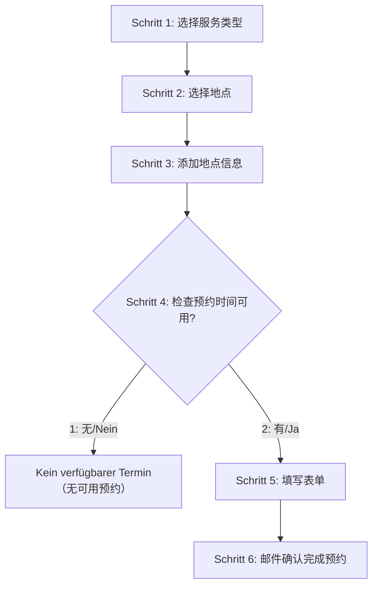

# Aachen Termin Bot

亚琛 SuperC 外管局（Ausländeramt）自动预约机器人。  
https://termine.staedteregion-aachen.de/auslaenderamt/

## 🏗️ 项目架构

```
aachen-termin-bot/
├── superc.py              # SuperC地点预约入口
├── superc/                # 核心功能模块
│   ├── appointment_checker.py  # 预约检查逻辑
│   ├── form_filler.py          # 表单填写逻辑
│   ├── llmCall.py             # Azure OpenAI验证码识别
│   ├── utils.py               # 工具函数
│   └── config.py              # 配置文件
├── data/                  # 数据目录
│   ├── table              # 个人信息文件（主要）
│   ├── debugPage/         # 调试页面保存
│   └── logs/              # 日志文件
├── db/                    # 链接Supabase的数据库模块
│   ├── models.py          # 数据库模型定义
│   └── utils.py           # 数据库操作
└── tests/                 # 测试文件
```

## 📋 SuperC 官网的预约流程

### 完整的6步流程
- **Schritt 1**: Auswahl der Funktionseinheit，Aufenthaltsangelegenheiten
- **Schritt 2**: 选择RWTH学生服务类型和地点
- **Schritt 3**: 添加地点信息（Standortauswahl）  
- **Schritt 4**: 检查预约时间可用性并选择第一个可用时间
- **Schritt 5**: 下载验证码，填写个人信息表单
- **Schritt 6**: 邮件确认，完成预约



## 🚀 快速开始

> 💡 **推荐使用 uv**: 本项目支持使用 [uv](https://github.com/astral-sh/uv) 进行 Python 包管理，相比传统的 pip 更快更可靠。  
如果你还没有安装 uv，可以通过 `pip install uv` 安装。

### 1. 环境准备

```bash
# 使用uv创建虚拟环境并安装依赖
uv venv --python 3.10
source .venv/bin/activate  # Linux/Mac
# .venv\Scripts\activate  # Windows

# 使用uv安装依赖
uv pip install -r requirements.txt
uv sync

uv add xxx
```

### 2. 配置环境变量

创建 `.env` 从 `.env.example` 文件并配置。


### 3. 运行程序

#### SuperC地点预约
```bash
# 或者激活虚拟环境后运行
source .venv/bin/activate
python superc.py

# 使用uv运行（推荐）
uv run superc.py

uv run pytest

# 后台运行并记录日志
nohup uv run python superc.py 2>&1 | tee superc.log &
```


## 🔧 配置说明


### 日志配置
- 日志级别：INFO
- 详细日志模式：可在config.py中开启`VERBOSE_LOGGING`
- 日志文件自动保存在 `data/logs/` 目录


## 📊 运行状态/logs

### 成功预约的标志
- 日志显示："预约成功完成"
- 进入Schritt 6确认页面
- 收到邮件确认

### 常见状态消息
- `"zu vieler Terminanfragen"`: 一个账号约了太多次，没有确认，就会被系统锁定一段时间，需等待解锁后继续预约。换一个账号继续预约即可。


## 🟢 连接 Supabase（数据库）

后端使用 SQLAlchemy 连接 Supabase 的 PostgreSQL。请在运行环境中设置以下环境变量（`.env`）：

直连（Direct，默认 5432）：

```
DB_USER=postgres
DB_PASSWORD=YOUR_DB_PASSWORD
DB_HOST=db.PROJECT_REF.supabase.co
DB_PORT=5432
DB_NAME=postgres
```


如果连接成功，会打印 “Connection successful!” 并显示等待队列统计。


## crontab 示例（每小时运行一次）：

```bash
* 6 * * * cd /home/hanbin/workspace/superC-termin-bot && /home/hanbin/workspace/superC-termin-bot/.venv/bin/python superc.py >> superc.log 2>&1

# 测试
* * * * *
```


