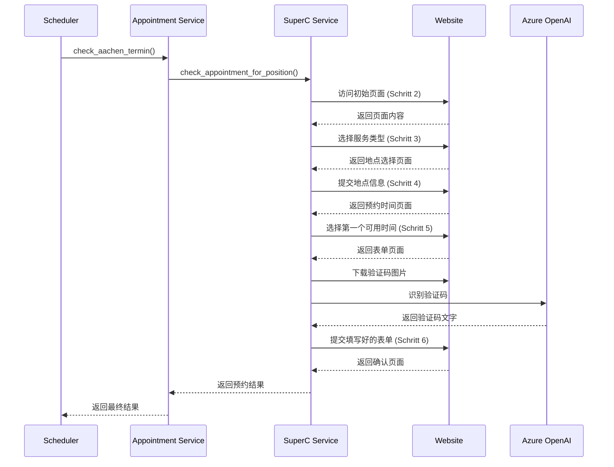

# Aachen Termin Bot

亚琛外管局（Ausländeramt）自动预约机器人，支持SuperC和Infostelle两个地点的RWTH学生预约。

## ✨ 特性

- 🤖 **全自动预约流程**：完整的6步预约流程自动化
- 🧠 **智能验证码识别**：使用Azure OpenAI GPT-4V识别验证码
- 📅 **智能日期判断**：自动判断预约日期并使用对应的个人信息
- ⏰ **智能调度**：自动重试，22点后停止运行
- 📝 **详细日志**：完整的操作日志和调试信息
- 🔧 **模块化设计**：易于扩展和维护

## 🏗️ 项目架构

```
aachen-termin-bot/
├── superc.py              # SuperC地点预约入口
├── infostelle.py          # Infostelle地点预约入口
├── superc/                # 核心功能模块
│   ├── appointment_checker.py  # 预约检查逻辑
│   ├── form_filler.py          # 表单填写逻辑
│   ├── llmCall.py             # Azure OpenAI验证码识别
│   ├── utils.py               # 工具函数
│   └── config.py              # 配置文件
├── data/                  # 数据目录
│   ├── table              # 个人信息文件（主要）
│   ├── debugPage/         # 调试页面保存
│   └── logs/              # 日志文件
└── tests/                 # 测试文件
```

## 📋 预约流程

### 完整的6步流程
1. **Schritt 2**: 选择RWTH学生服务类型和地点
2. **Schritt 3**: 添加地点信息（Standortauswahl）  
3. **Schritt 4**: 检查预约时间可用性并选择第一个可用时间
4. **Schritt 5**: 下载验证码，填写个人信息表单
5. **Schritt 6**: 邮件确认，完成预约

### 流程图


## 🚀 快速开始

> 💡 **推荐使用 uv**: 本项目支持使用 [uv](https://github.com/astral-sh/uv) 进行 Python 包管理，相比传统的 pip 更快更可靠。如果你还没有安装 uv，可以通过 `curl -LsSf https://astral.sh/uv/install.sh | sh` 安装。

### 1. 环境准备

```bash
# 使用uv创建虚拟环境并安装依赖
uv venv
source .venv/bin/activate  # Linux/Mac
# .venv\Scripts\activate  # Windows

# 使用uv安装依赖
uv pip install -r requirements.txt
```

### 2. 配置环境变量

创建 `.env` 文件并配置Azure OpenAI：

```bash
# Azure OpenAI配置 (用于验证码识别)
AZURE_OPENAI_ENDPOINT=https://your-resource.openai.azure.com/
AZURE_OPENAI_KEY=your-azure-openai-key
AZURE_OPENAI_DEPLOYMENT_NAME=your-gpt4v-deployment-name
AZURE_OPENAI_API_VERSION=2024-12-01-preview
```

### 3. 配置个人信息

#### 主要个人信息文件 (`data/table`)
创建JSON格式的个人信息文件：

```json
[
    {
        "beschreibung": "Vorname",
        "fuellen_in_name": "vorname", 
        "typ": "text",
        "wert_zum_fuellen": "Your First Name"
    },
    {
        "beschreibung": "Nachname",
        "fuellen_in_name": "nachname",
        "typ": "text", 
        "wert_zum_fuellen": "Your Last Name"
    },
    {
        "beschreibung": "E-Mail",
        "fuellen_in_name": "email",
        "typ": "email",
        "wert_zum_fuellen": "your.email@example.com"
    }
    // ... 更多字段请参考 data/table.example
]
```


### 4. 运行程序

#### SuperC地点预约
```bash
# 前台运行
uv run superc.py
# 或使用传统方式
python superc.py

# 后台运行并记录日志
nohup uv run superc.py 2>&1 | tee superc.log &
```

#### Infostelle地点预约  
```bash
# 前台运行
uv run infostelle.py
# 或使用传统方式
python infostelle.py

# 后台运行
nohup uv run infostelle.py > infostelle.log 2>&1 &
```


## 📦 依赖项

| 包名 | 版本 | 用途 |
|-----|------|------|
| requests | >=2.31.0 | HTTP请求和网页抓取 |
| beautifulsoup4 | >=4.12.0 | HTML解析 |
| python-dotenv | ==1.0.0 | 环境变量管理 |
| openai | >=1.0.0 | Azure OpenAI API客户端 |

## 🔧 配置说明

### 位置配置
项目支持两个预约地点，配置在 `superc/config.py` 中：

- **SuperC**: RWTH大学外管局分点
- **Infostelle**: 主要信息咨询处

### 日志配置
- 日志级别：INFO
- 详细日志模式：可在config.py中开启`VERBOSE_LOGGING`
- 日志文件自动保存在 `data/logs/` 目录

### 智能特性
1. **时间控制**：22点后自动停止运行
2. **日期判断**：9月前预约自动切换个人信息文件
3. **错误重试**：网络错误自动重试，每分钟检查一次
4. **页面保存**：调试模式下自动保存各步骤的HTML页面

## 🧪 测试

```bash
# 运行所有测试
uv run tests/run_tests.py
# 或使用传统方式
python tests/run_tests.py

# 运行特定测试
uv run tests/test_config.py
uv run tests/test_integration.py

# 使用pytest (需先安装)
uv pip install pytest
uv run pytest tests/
```

## 📊 运行状态

### 成功预约的标志
- 日志显示："预约成功完成"
- 进入Schritt 6确认页面
- 收到邮件确认

### 常见状态消息
- `"当前没有可用预约时间"`: 暂无预约时段
- `"zu vieler Terminanfragen"`: 请求过于频繁

### 日志文件位置
- SuperC: `superc.log`
- Infostelle: `infostelle.log`  
- 调试页面: `data/debugPage/`
- 验证码图片: `pages/{location}/captcha/`

## ⚠️ 注意事项

1. **API配额**：Azure OpenAI验证码识别会消耗token
2. **请求频率**：程序每分钟检查一次，避免过于频繁
3. **个人信息**：确保`data/table`文件信息正确且最新
4. **网络环境**：需要稳定的网络连接访问外管局网站
5. **时间限制**：建议在工作时间运行，22点后自动停止

## 🤝 贡献

欢迎提交Issue和Pull Request来改进这个项目！

## 📄 许可证

MIT License