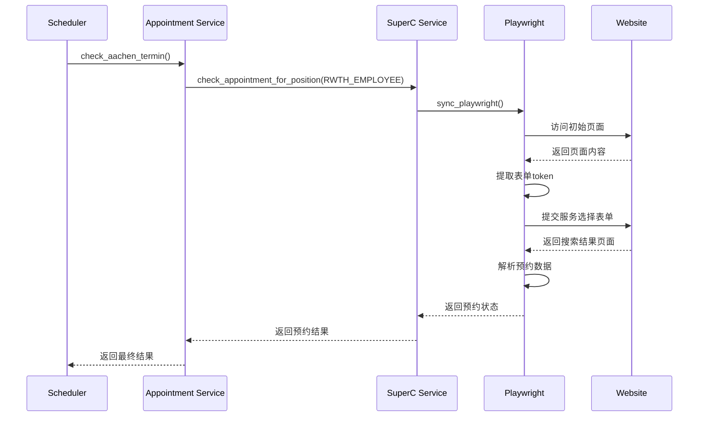

# 项目介绍
request
https://termine.staedteregion-aachen.de/auslaenderamt/select2?md=1
起始网站
页面上有html 代码：
<h1> Schritt 2<span class="visuallyhidden"> von 6</span>: Aufenthaltsangelegenheiten - Auswahl des Anliegens </h1>
选择 RWTH Studenten，然后点击 weiter。

下个步骤页面上有html 代码：
<h1> Schritt 3<span class="visuallyhidden"> von 6</span>: Terminvorschläge - Standortauswahl </h1>
继续点 weiter。

刷新后的页面上有html 代码：
<h1> Schritt 4<span class="visuallyhidden"> von 6</span>: Terminvorschläge - Keine Zeiten verfügbar </h1>
一般就显示 Kein freier Termin verfügbar 了。

### 预约检查序列图



# Aachen Termin Bot

这是一个用于自动检查亚琛外管局（Ausländeramt）预约时间的机器人。

## 功能特点

- 自动检查亚琛外管局预约系统
- 每3分钟自动检查一次
- 详细的日志记录
- 支持健康检查接口

## 项目结构

```
.
├── app.py              # Flask应用主文件
├── superc.py           # 预约检查核心逻辑
├── requirements.txt    # 项目依赖
├── logs/              # 日志目录
└── pages/             # 页面内容存储目录
```

## 安装

1. 克隆仓库：
```bash
git clone [repository-url]
cd aachen-termin-bot
```

2. 创建并激活虚拟环境：
```bash
python -m venv .venv
source .venv/bin/activate  # Linux/Mac
```

3. 安装依赖：
```bash
pip install -r requirements.txt
```

## 运行

```bash
source .venv/bin/activate && nohup python app.py > app.log 2>&1 &
```

应用将在 8318 端口启动（可通过环境变量 PORT 修改）。

## API 接口

- `GET /` - 检查服务是否运行
- `GET /status` - 健康检查接口

## 日志

日志文件存储在 `logs` 目录下，按日期命名。同时也会在控制台输出。

## 注意事项

- 请确保网络连接稳定
- 建议使用代理服务器以避免IP被封
- 定期检查日志文件大小
