# Aachen Termin Bot

亚琛外管局（Ausländeramt）自动预约机器人，支持SuperC和Infostelle两个地点的RWTH学生预约。  
https://termine.staedteregion-aachen.de/auslaenderamt/

## ✨ 特性

- 🤖 **全自动预约流程**：完整的6步预约流程自动化
- 🧠 **智能验证码识别**：使用 OpenAI GPT 识别验证码
- 📅 **智能日期判断**：自动判断预约日期并使用对应的个人信息
- ⏰ **智能调度**：自动重试，22点后停止运行
- 📝 **详细日志**：完整的操作日志和调试信息
- 🔧 **模块化设计**：易于扩展和维护

## 🏗️ 项目架构

```
aachen-termin-bot/
├── superc.py              # SuperC地点预约入口
├── infostelle.py          # Infostelle地点预约入口
├── superc/                # 核心功能模块
│   ├── appointment_checker.py  # 预约检查逻辑
│   ├── form_filler.py          # 表单填写逻辑
│   ├── llmCall.py             # Azure OpenAI验证码识别
│   ├── utils.py               # 工具函数
│   └── config.py              # 配置文件
├── data/                  # 数据目录
│   ├── table              # 个人信息文件（主要）
│   ├── debugPage/         # 调试页面保存
│   └── logs/              # 日志文件
└── tests/                 # 测试文件
```

## 📋 官网的预约流程

### 完整的6步流程
1. **Schritt 1**: Auswahl der Funktionseinheit，Aufenthaltsangelegenheiten
1. **Schritt 2**: 选择RWTH学生服务类型和地点
2. **Schritt 3**: 添加地点信息（Standortauswahl）  
3. **Schritt 4**: 检查预约时间可用性并选择第一个可用时间
4. **Schritt 5**: 下载验证码，填写个人信息表单
5. **Schritt 6**: 邮件确认，完成预约

### 流程图

```mermaid
sequenceDiagram
    participant S as Scheduler
    participant A as Appointment Service
    participant SC as SuperC Service
    participant W as Website
    participant AI as Azure OpenAI

    S->>A: check_aachen_termin()
    A->>SC: check_appointment_for_position()
    SC->>W: 访问初始页面 (Schritt 2)
    W-->>SC: 返回页面内容
    SC->>W: 选择服务类型 (Schritt 3)
    W-->>SC: 返回地点选择页面
    SC->>W: 提交地点信息 (Schritt 4)
    W-->>SC: 返回预约时间页面
    SC->>W: 选择第一个可用时间 (Schritt 5)
    W-->>SC: 返回表单页面
    SC->>W: 下载验证码图片
    SC->>AI: 识别验证码
    AI-->>SC: 返回验证码文字
    SC->>W: 提交填写好的表单 (Schritt 6)
    W-->>SC: 返回确认页面
    SC-->>A: 返回预约结果
    A-->>S: 返回最终结果
```


## 🚀 快速开始

> 💡 **推荐使用 uv**: 本项目支持使用 [uv](https://github.com/astral-sh/uv) 进行 Python 包管理，相比传统的 pip 更快更可靠。  
如果你还没有安装 uv，可以通过 `pip install uv` 安装。

### 1. 环境准备

```bash
# 使用uv创建虚拟环境并安装依赖
uv venv --python 3.10
source .venv/bin/activate  # Linux/Mac
# .venv\Scripts\activate  # Windows

# 使用uv安装依赖
uv pip install -r requirements.txt
```

### 2. 配置环境变量

创建 `.env` 文件并配置Azure OpenAI：

```bash
# Azure OpenAI配置 (用于验证码识别)
AZURE_OPENAI_ENDPOINT=https://your-resource.openai.azure.com/
AZURE_OPENAI_KEY=your-azure-openai-key
AZURE_OPENAI_DEPLOYMENT_NAME=your-gpt4v-deployment-name
AZURE_OPENAI_API_VERSION=2024-12-01-preview
```


### 3. 运行程序

#### SuperC地点预约
```bash
# 使用uv运行（推荐）
uv run python superc.py

# 或者激活虚拟环境后运行
source .venv/bin/activate
python superc.py

# 后台运行并记录日志
nohup uv run python superc.py 2>&1 | tee superc.log &
```

#### Infostelle地点预约  
```bash
# 使用uv运行（推荐）
uv run python infostelle.py

# 或者激活虚拟环境后运行
source .venv/bin/activate
python infostelle.py

# 后台运行
nohup uv run python infostelle.py > infostelle.log 2>&1 &
```


## 🔧 配置说明

### 位置配置
项目支持两个预约地点，配置在 `superc/config.py` 中：

- **SuperC**: RWTH大学外管局分点
- **Infostelle**: 主要信息咨询处

### 日志配置
- 日志级别：INFO
- 详细日志模式：可在config.py中开启`VERBOSE_LOGGING`
- 日志文件自动保存在 `data/logs/` 目录


## 📊 运行状态

### 成功预约的标志
- 日志显示："预约成功完成"
- 进入Schritt 6确认页面
- 收到邮件确认

### 常见状态消息
- `"zu vieler Terminanfragen"`: 请求过于频繁

### 日志文件位置
- SuperC: `superc.log`
- Infostelle: `infostelle.log`  
- 调试页面: `data/debugPage/`
- 验证码图片: `pages/{location}/captcha/`

## ⚠️ 注意事项

1. **API配额**：Azure OpenAI验证码识别会消耗token
2. **请求频率**：程序每分钟检查一次，避免过于频繁
3. **个人信息**：确保`data/table`文件信息正确且最新
4. **时间限制**：建议在工作时间运行，22点后自动停止

## 🟢 连接 Supabase（数据库）

后端使用 SQLAlchemy 连接 Supabase 的 PostgreSQL。请在运行环境中设置以下环境变量（`.env`）：

直连（Direct，默认 5432）：

```
DB_USER=postgres
DB_PASSWORD=YOUR_DB_PASSWORD
DB_HOST=db.PROJECT_REF.supabase.co
DB_PORT=5432
DB_NAME=postgres
```

或使用连接池（Pooler，常见 6543）：

```
DB_USER=postgres
DB_PASSWORD=YOUR_DB_PASSWORD
DB_HOST=PROJECT_REF.pooler.supabase.com
DB_PORT=6543
DB_NAME=postgres
```

代码会拼接出如下连接串并强制启用 SSL：

```
postgresql+psycopg2://DB_USER:DB_PASSWORD@DB_HOST:DB_PORT/DB_NAME?sslmode=require
```

快速连通性检查（可选）：

```
uv run python -m db.utils
```

如果连接成功，会打印 “Connection successful!” 并显示等待队列统计。


## crontab 示例（每小时运行一次）：

```bash
* 6 * * * cd /home/hanbin/workspace/superC-termin-bot && /home/hanbin/workspace/superC-termin-bot/.venv/bin/python superc.py >> superc.log 2>&1

# 测试
* * * * *
```


