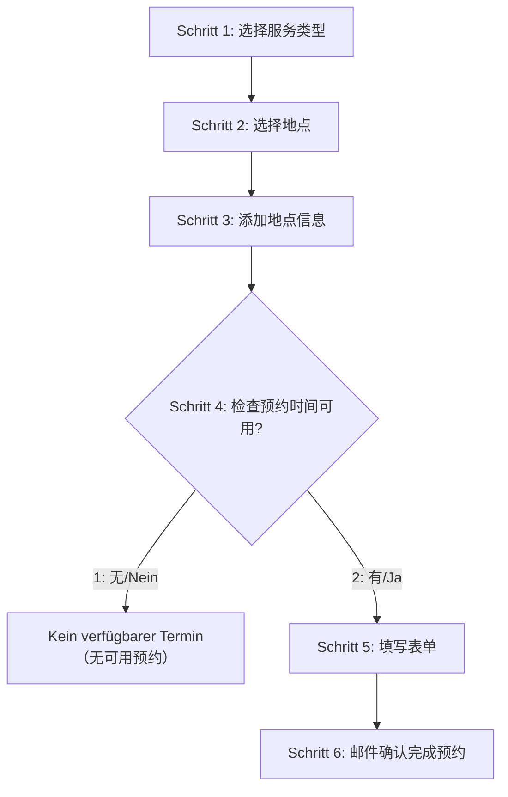

# 📋 SuperC 官网的预约流程

目标网站：https://termine.staedteregion-aachen.de/auslaenderamt/

## 完整的6步流程

- **Schritt 1**: Auswahl der Funktionseinheit，Aufenthaltsangelegenheiten
- **Schritt 2**: 选择RWTH学生服务类型和地点
- **Schritt 3**: 添加地点信息（Standortauswahl）  
- **Schritt 4**: 检查预约时间可用性并选择第一个可用时间
- **Schritt 5**: 下载验证码，填写个人信息表单
- **Schritt 6**: 邮件确认，完成预约

